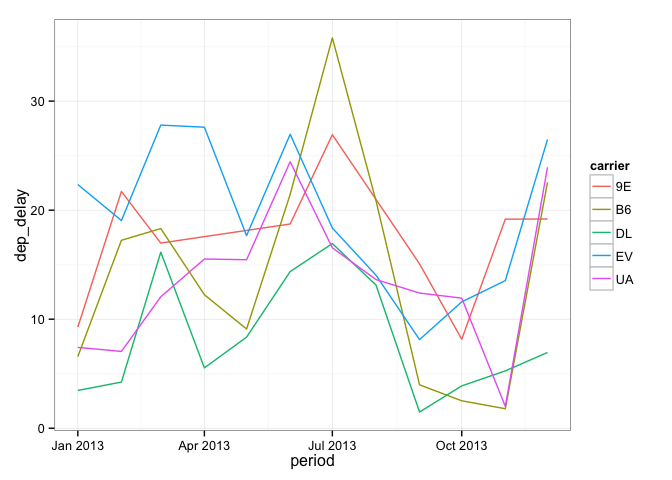
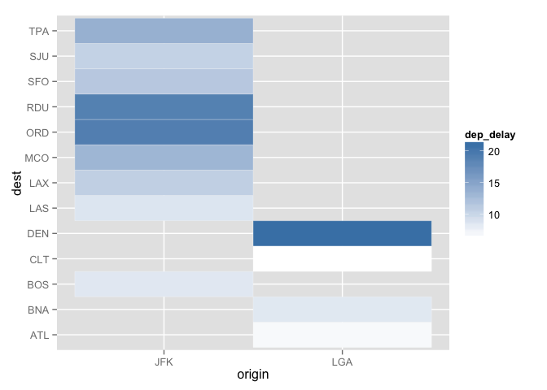

# SparkRext - SparkR extension for dplyr


This is a fork of the excellent package [SparkRext](https://github.com/hoxo-m/SparkRext), by [@hoxo-m](https://github.com/hoxo-m), which enables users to use [dplyr](https://github.com/saurfang/dplyr) NSE style calls for all data wrangling functions. However it's still impossible to use these functions for distributed Spark DataFrame and local R DataFrame at the same time. This fork enables such use case as shown below.

The motivation is that while SparkR provides a powerful interface to transform distributed DataFrame and practice machine learning algorithms, R still excels in small data world such as [data visualization](#interoperability-between-sparkr-and-dplyr), small data aggregation and etc. 


## Overview

[Apache Spark](https://spark.apache.org/) is one of the hottest products in data science.  
Spark 1.4.0 has formally adopted **SparkR** package which enables to handle Spark DataFrames on R.(See [this article](http://databricks.com/blog/2015/06/09/announcing-sparkr-r-on-spark.html))

SparkR is very useful and powerful.  
One of the reasons is that SparkR DataFrames present an API similar to **dplyr**.  

For example:


```r
df <- createDataFrame(sqlContext, iris)
df %>%
  select("Sepal_Length", "Species") %>%
  filter(df$Sepal_Length >= 5.5) %>%
  group_by(df$Species) %>%
  summarize(count = n(df$Sepal_Length), mean = mean(df$Sepal_Length)) %>%
  collect  
```

This is very cool. But I have a little discontent.

One of the reasons that dplyr is so much popular is the functions adopts NSE(non-standard evaluation).


```r
library(dplyr)
iris %>%
  select(Sepal.Length, Species) %>%
  filter(Sepal.Length >= 5.5) %>%
  group_by(Species) %>%
  summarize(count = n(), mean = mean(Sepal.Length))
```

```
## Source: local data frame [3 x 3]
## 
##      Species count     mean
##       (fctr) (int)    (dbl)
## 1     setosa     5 5.640000
## 2 versicolor    44 6.050000
## 3  virginica    49 6.622449
```

It's very smart.  
With NSE, you don't need to type quotations or names of DataFrame that the columns belong to.

The package **SparkRext** have been created to make SparkR be closer to dplyr.


```r
library(SparkRext)
df <- createDataFrame(sqlContext, iris)
df %>%
  select(Sepal_Length, Species) %>%
  filter(Sepal_Length >= 5.5) %>%
  group_by(Species) %>%
  summarize(count = n(Sepal_Length), mean = mean(Sepal_Length)) %>%
  collect  
```

```
##      Species count     mean
## 1 versicolor    44 6.050000
## 2     setosa     5 5.640000
## 3  virginica    49 6.622449
```

SparkRext redefines the functions of SparkR to enable NSE inputs.  
As a result, the functions will be able to be used in the same way as dplyr.

## How to install

You can install the package from there.


```r
install.packages("devtools") # if you have not installed "devtools" package
devtools::install_github("saurfang/SparkRext")
```

## 3. Functions

SparkRext redefines six functions on SparkR.

- `filter()`
- `select()`
- `mutate()`
- `arrange()`
- `summarize()`
- `group_by()`

Note we only redefine the generic functions for Spark DataFrame so these functions can still be used with local data frame.

In this section, these funcions are explained.

For illustration, let’s prepare data.


```r
library(dplyr)
library(nycflights13)
library(SparkR)

set.seed(123)
data <- sample_n(flights, 10000)

library(SparkRext)

df <- createDataFrame(sqlContext, data.frame(data))
df %>% head
```

```
##   year month day dep_time dep_delay arr_time arr_delay carrier tailnum
## 1 2013    12  15     2124        -4     2322         1      UA  N801UA
## 2 2013     7  17      651        -9      936       -28      DL  N194DN
## 3 2013     3   2     1636         1     1800         0      WN  N475WN
## 4 2013     8  19     1058        -2     1203       -32      WN  N765SW
## 5 2013     9   9     1251        -9     1412         3      US  N963UW
## 6 2013     1  18     1259        -1     1556       -14      WN  N654SW
##   flight origin dest air_time distance hour minute
## 1    289    EWR  DTW       88      488   21     24
## 2    763    JFK  LAX      306     2475    6     51
## 3   1501    LGA  MKE      103      738   16     36
## 4     51    LGA  MDW      107      725   10     58
## 5   2148    LGA  BOS       38      184   12     51
## 6   2239    EWR  HOU      222     1411   12     59
```

### `filter()`

`filter()` is used to extract rows that the conditions specified are satisfied.


```r
df %>% filter(month == 12, day == 31) %>% head
```

```
##   year month day dep_time dep_delay arr_time arr_delay carrier tailnum
## 1 2013    12  31     1155        -5     1257       -11      B6  N216JB
## 2 2013    12  31     2211        12      100        15      B6  N715JB
## 3 2013    12  31     1504         9     1620        -5      MQ  N501MQ
## 4 2013    12  31     2328        -2      412         3      B6  N651JB
## 5 2013    12  31     1922        -8     2116         1      MQ  N501MQ
## 6 2013    12  31      849        -1     1225        -3      B6  N834JB
##   flight origin dest air_time distance hour minute
## 1    316    JFK  SYR       50      209   11     55
## 2   1183    JFK  MCO      148      944   22     11
## 3   3425    JFK  DCA       52      213   15      4
## 4   1389    EWR  SJU      198     1608   23     28
## 5   3535    JFK  CMH       82      483   19     22
## 6     15    JFK  SFO      371     2586    8     49
```


```r
df %>% filter(month == 12 | day == 31) %>% head
```

```
##   year month day dep_time dep_delay arr_time arr_delay carrier tailnum
## 1 2013    12  15     2124        -4     2322         1      UA  N801UA
## 2 2013    12  30     2031        -4     2351         4      DL  N3743H
## 3 2013    12  16     1248        -4     1407        -4      EV  N11548
## 4 2013    12  27      928        28     1307        48      DL  N901DE
## 5 2013    12   7     1719       -10     2008         8      F9  N209FR
## 6 2013    12  10       NA        NA       NA        NA      EV  N717EV
##   flight origin dest air_time distance hour minute
## 1    289    EWR  DTW       88      488   21     24
## 2   2065    JFK  FLL      173     1069   20     31
## 3   6054    EWR  IAD       49      212   12     48
## 4   2446    LGA  FLL      186     1076    9     28
## 5    507    LGA  DEN      269     1620   17     19
## 6   5245    LGA  PIT       NA      335   NA     NA
```

Note that `filter()` of SparkR cannot accept multiple conditions at once.

### `select()`

`select()` is used to extract columns specified.


```r
df %>% select(year, month, day) %>% head
```

```
##   year month day
## 1 2013    12  15
## 2 2013     7  17
## 3 2013     3   2
## 4 2013     8  19
## 5 2013     9   9
## 6 2013     1  18
```

Continuous columns can be extracted using a colon `:`.


```r
df %>% select(year:day) %>% head
```

```
##   year month day
## 1 2013    12  15
## 2 2013     7  17
## 3 2013     3   2
## 4 2013     8  19
## 5 2013     9   9
## 6 2013     1  18
```

You can use the minus sign `-` to extract columns with the exception of columns specified.


```r
df %>% select(-year, -month, -day) %>% head
```

```
##   dep_time dep_delay arr_time arr_delay carrier tailnum flight origin dest
## 1     2124        -4     2322         1      UA  N801UA    289    EWR  DTW
## 2      651        -9      936       -28      DL  N194DN    763    JFK  LAX
## 3     1636         1     1800         0      WN  N475WN   1501    LGA  MKE
## 4     1058        -2     1203       -32      WN  N765SW     51    LGA  MDW
## 5     1251        -9     1412         3      US  N963UW   2148    LGA  BOS
## 6     1259        -1     1556       -14      WN  N654SW   2239    EWR  HOU
##   air_time distance hour minute
## 1       88      488   21     24
## 2      306     2475    6     51
## 3      103      738   16     36
## 4      107      725   10     58
## 5       38      184   12     51
## 6      222     1411   12     59
```

You can also extract columns by using column numbers.


```r
df %>% select(1, 2, 3) %>% head
```

```
##   year month day
## 1 2013    12  15
## 2 2013     7  17
## 3 2013     3   2
## 4 2013     8  19
## 5 2013     9   9
## 6 2013     1  18
```

You can use the select utility functions in dplyr such as `starts_with()`.


```r
df %>% select(starts_with("arr")) %>% head
```

```
##   arr_time arr_delay
## 1     2322         1
## 2      936       -28
## 3     1800         0
## 4     1203       -32
## 5     1412         3
## 6     1556       -14
```

All select utility functions is below.

- `starts_with(match, ignore.case = TRUE)`
- `ends_with(match, ignore.case = TRUE)`
- `contains(match, ignore.case = TRUE)`
- `matches(match, ignore.case = TRUE)`
- `num_range(prefix, range, width = NULL)`
- `one_of(...)`
- `everything()`

Note that `select()` of SparkR cannot accept a variety of input like this.

### `mutate()`

`mutate()` is used to add new columns.


```r
df %>% mutate(gain = arr_delay - dep_delay, speed = distance / air_time * 60) %>% head
```

```
##   year month day dep_time dep_delay arr_time arr_delay carrier tailnum
## 1 2013    12  15     2124        -4     2322         1      UA  N801UA
## 2 2013     7  17      651        -9      936       -28      DL  N194DN
## 3 2013     3   2     1636         1     1800         0      WN  N475WN
## 4 2013     8  19     1058        -2     1203       -32      WN  N765SW
## 5 2013     9   9     1251        -9     1412         3      US  N963UW
## 6 2013     1  18     1259        -1     1556       -14      WN  N654SW
##   flight origin dest air_time distance hour minute gain    speed
## 1    289    EWR  DTW       88      488   21     24    5 332.7273
## 2    763    JFK  LAX      306     2475    6     51  -19 485.2941
## 3   1501    LGA  MKE      103      738   16     36   -1 429.9029
## 4     51    LGA  MDW      107      725   10     58  -30 406.5421
## 5   2148    LGA  BOS       38      184   12     51   12 290.5263
## 6   2239    EWR  HOU      222     1411   12     59  -13 381.3514
```

Note that `mutate()` of SparkR cannot accept multiple input at once.  
Furthermore, `mutate()` of SparkR cannot also reuse columns added like below.


```r
df %>% mutate(gain = arr_delay - dep_delay, gain_per_hour = gain/(air_time/60)) %>% head
```

```
##   year month day dep_time dep_delay arr_time arr_delay carrier tailnum
## 1 2013    12  15     2124        -4     2322         1      UA  N801UA
## 2 2013     7  17      651        -9      936       -28      DL  N194DN
## 3 2013     3   2     1636         1     1800         0      WN  N475WN
## 4 2013     8  19     1058        -2     1203       -32      WN  N765SW
## 5 2013     9   9     1251        -9     1412         3      US  N963UW
## 6 2013     1  18     1259        -1     1556       -14      WN  N654SW
##   flight origin dest air_time distance hour minute gain gain_per_hour
## 1    289    EWR  DTW       88      488   21     24    5     3.4090909
## 2    763    JFK  LAX      306     2475    6     51  -19    -3.7254902
## 3   1501    LGA  MKE      103      738   16     36   -1    -0.5825243
## 4     51    LGA  MDW      107      725   10     58  -30   -16.8224299
## 5   2148    LGA  BOS       38      184   12     51   12    18.9473684
## 6   2239    EWR  HOU      222     1411   12     59  -13    -3.5135135
```

### `arrange()`

`arrange()` is used to sort rows by columns specified.


```r
df %>% arrange(month, day) %>% head
```

```
##   year month day dep_time dep_delay arr_time arr_delay carrier tailnum
## 1 2013     1   1     1353        -4     1549        24      EV  N14105
## 2 2013     1   1     1832         4     2144         0      UA  N18220
## 3 2013     1   1      602        -3      821        16      MQ  N730MQ
## 4 2013     1   1     1416         5     1603        14      UA  N456UA
## 5 2013     1   1     1127        -2     1303        -6      EV  N14180
## 6 2013     1   1     2323        83       22        69      EV  N13538
##   flight origin dest air_time distance hour minute
## 1   4171    EWR  MSN      152      799   13     53
## 2   1075    EWR  SNA      342     2434   18     32
## 3   4401    LGA  DTW      105      502    6      2
## 4    683    EWR  ORD      136      719   14     16
## 5   4294    EWR  RDU       73      416   11     27
## 6   4257    EWR  BTV       44      266   23     23
```

It will be sorted in ascending order if you write just column names.  
If you want to sort in descending order, you can use `desc()`.


```r
df %>% arrange(month, desc(day)) %>% head
```

```
##   year month day dep_time dep_delay arr_time arr_delay carrier tailnum
## 1 2013     1  31     1424        -5     1752        -2      UA  N512UA
## 2 2013     1  31     1853        -2     2149         7      DL  N175DZ
## 3 2013     1  31      958        -2     1251       -30      UA  N464UA
## 4 2013     1  31     1448       105     1635       131      B6  N292JB
## 5 2013     1  31       NA        NA       NA        NA      US        
## 6 2013     1  31     1358        -7     1717        12      B6  N554JB
##   flight origin dest air_time distance hour minute
## 1    257    JFK  SFO      355     2586   14     24
## 2    951    JFK  ATL      129      760   18     53
## 3    499    EWR  SEA      324     2402    9     58
## 4     32    JFK  ROC       54      264   14     48
## 5   1625    LGA  CLT       NA      544   NA     NA
## 6     63    JFK  TPA      164     1005   13     58
```

You can also sort by values that are transformed from columns.


```r
df %>% arrange(abs(dep_delay)) %>% head
```

```
##   year month day dep_time dep_delay arr_time arr_delay carrier tailnum
## 1 2013     1  28       NA        NA       NA        NA      EV  N13969
## 2 2013     2   9       NA        NA       NA        NA      UA        
## 3 2013     1  25       NA        NA       NA        NA      US        
## 4 2013    12  10       NA        NA       NA        NA      EV  N717EV
## 5 2013    11  26       NA        NA       NA        NA      EV  N755EV
## 6 2013     7   1       NA        NA       NA        NA      MQ  N711MQ
##   flight origin dest air_time distance hour minute
## 1   4588    EWR  MHT       NA      209   NA     NA
## 2   1274    EWR  SJU       NA     1608   NA     NA
## 3   2138    LGA  BOS       NA      184   NA     NA
## 4   5245    LGA  PIT       NA      335   NA     NA
## 5   5048    LGA  RIC       NA      292   NA     NA
## 6   3388    LGA  CMH       NA      479   NA     NA
```

### `summarize()`

`summarize()` is used to collapse a DataFrame to a single row.


```r
df %>% summarize(count = n(year)) %>% collect
```

```
##   count
## 1 10000
```

Typically, `summarize()` is used with `group_by()` to collapse each group to a single row.

As far as I know, you can use the following functions in `summarize()`.

- `n()`
- `n_distinct()`
- `approxCountDistinct()`
- `mean()`
- `first()`
- `last()`

It seems that other aggregate functions are available in Scala (See [docs](http://spark.apache.org/docs/1.4.0/api/scala/index.html#org.apache.spark.sql.functions$)).

Like dplyr, you can use `summarise()` instead of `simmarize()`.

### `group_by()`

`group_by()` is used to describe how to break a DataFrame down into groups of rows.  
Usually it is used with `summarize()` to collapse each group to a single row.


```r
df %>% 
  group_by(tailnum) %>%
  summarize(mean_distance = mean(distance)) %>% 
  head
```

```
##   tailnum mean_distance
## 1  N8580A      245.6667
## 2  N554JB     1274.5000
## 3  N600LR      695.0000
## 4  N3HAAA     1075.0000
## 5  N871AS      617.0000
## 6  N77518      642.5000
```

You can indicate multiple colmuns.


```r
df %>% 
  group_by(year, month, day) %>%
  summarize(count = n(year)) %>% 
  arrange(year, month, day) %>%
  head
```

```
##   year month day count
## 1 2013     1   1    25
## 2 2013     1   2    29
## 3 2013     1   3    24
## 4 2013     1   4    30
## 5 2013     1   5    16
## 6 2013     1   6    35
```

Unlike dplyr, only `summarize()` can receive the results of `group_by()`.

## How to use

To install SparkR 1.4.0, the next articles may be useful.

- [How to use SparkR within Rstudio?](http://www.r-bloggers.com/how-to-use-sparkr-within-rstudio/)
- [SparkR with Rstudio in Ubuntu 12.04](http://www.r-bloggers.com/sparkr-with-rstudio-in-ubuntu-12-04/)
- [Installing and Starting SparkR Locally on Windows OS and RStudio](http://blog.danielemaasit.com/2015/07/26/installing-and-starting-sparkr-locally-on-windows-8-1-and-rstudio/)

When you can load SparkR package, you will be also able to use SparkRext package.


```r
# Preparation of data
library(dplyr)
library(nycflights13)
set.seed(123)
data <- sample_n(flights, 10000)

# Load library
library(SparkR)
library(SparkRext)

# Create Spark context and SQL context
sc <- sparkR.init(master="local")
sqlContext <- sparkRSQL.init(sc)

# Create DataFrame
df <- createDataFrame(sqlContext, data.frame(data))

# Play with DataFrame
result <- df %>%
  select(year:day, flight, distance) %>%
  group_by(year, month, day) %>%
  summarize(flight_mean = mean(flight), distance_mean = mean(distance)) %>%
  filter(flight_mean >= 2000, distance_mean >= 1000) %>%
  arrange(year, month, day) %>%
  collect

# Print result
head(result)
```


```
##   year month day flight_mean distance_mean
## 1 2013     1  13    2271.043      1025.261
## 2 2013     1  24    2331.600      1092.850
## 3 2013     2  25    2055.471      1074.529
## 4 2013     3   5    2003.000      1003.448
## 5 2013     3   8    2167.138      1048.448
## 6 2013     3   9    2023.280      1168.400
```

## Interoperability between SparkR and dplyr

The appeal of SparkR is operating a large scale dataset with familiar R syntax.
However it would be a shame if we limit ourselves into relying on SparkR for all data manipulation.
For example, R visualization is very powerful and easy to use. You might want to produce a medium size aggregated local data.frame using SparkR and proceed further slice and dice during charting.

For example, we can look average departure delay in a few different dimensions

```r
library(ggplot2)

aggDF <- df %>%
  group_by(year, month, carrier, origin, dest) %>%
  summarise(n = n(dep_delay), dep_delay = mean(dep_delay)) %>%
  collect()

aggDF %>%
  group_by(period = as.Date(paste0(year, "-", month, "-01")), carrier) %>%
  summarise(total = n(), dep_delay = weighted.mean(dep_delay, n)) %>%
  # keep period/carrier with more than 20 observations
  filter(total > 20) %>%
  ggplot(aes(period, dep_delay, color = carrier)) +
  geom_line() +
  theme_bw()
```

 

```r
aggDF %>%
  group_by(origin, dest) %>%
  summarise(total = n(), dep_delay = weighted.mean(dep_delay, n)) %>%
  filter(total > 30) %>%
  ggplot(aes(origin, dest, fill = dep_delay)) +
  geom_tile(colour = "white") +
  scale_fill_gradient(low = "white", high = "steelblue")
```

 

As you can see, the seamless transition from large dataframe to small dataframe can be very powerful.
Data science is a not big data or small data endeavor. Having the same set of functions that allow us 
handle both end of the spectrum in the same project can deliver an really enjoyable experience.
